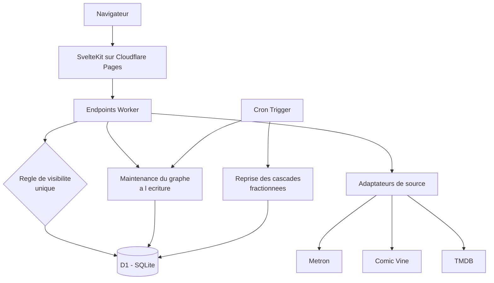
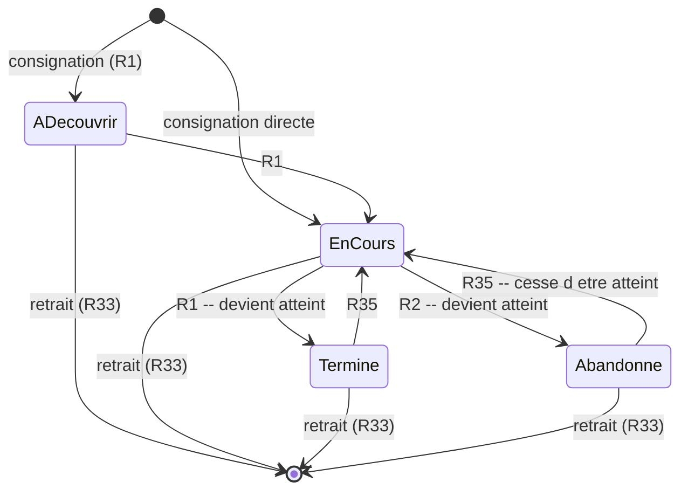
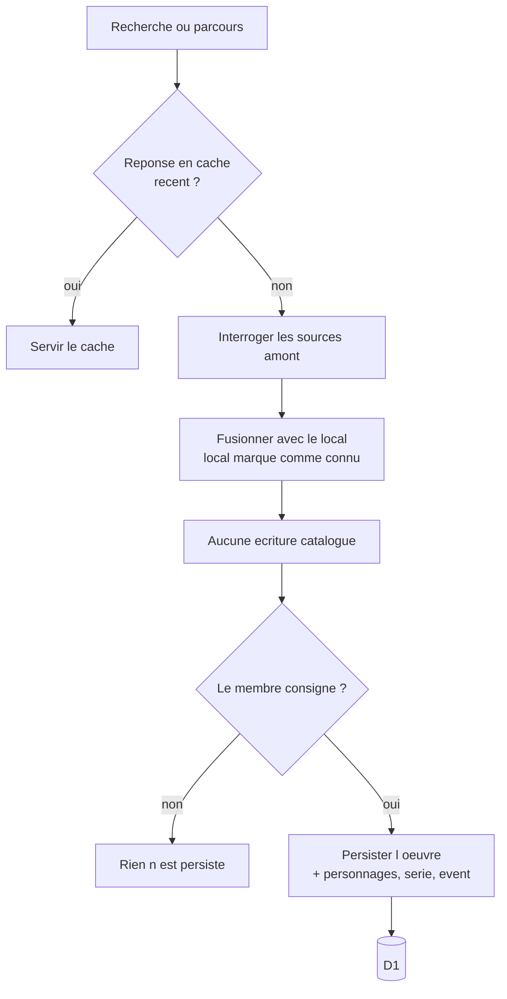

# feat: Compagnon partagé de l'univers Marvel

## Résumé

Construire, en greenfield et sans aucun outil payant, une application web pour un groupe fermé d'une vingtaine d'amis : consigner comics, films, séries et romans, noter, écrire des avis, créer et suivre des ordres de lecture, et faire apparaître un graphe de l'univers à mesure des lectures. Dix unités réparties en quatre phases, dont une première unité de vérification qui conditionne les autres.

---

## Cadrage du problème

Le document d'origine décrit un produit complet mais deux faits découverts en recherche redessinent son socle technique.

**L'API développeur Marvel n'existe plus.** Vérifié le 2026-08-01 : `developer.marvel.com` redirige vers le site grand public et `gateway.marvel.com` renvoie une erreur serveur là où une requête sans clé devrait être poliment refusée. Le catalogue comics — donc le graphe, qui dépend entièrement de la donnée d'apparition des personnages — doit venir d'ailleurs, et les candidats restants sont soit de licence non vérifiée (Metron), soit en déclin documenté (Comic Vine, propriété de Fandom). C'est le risque numéro un du projet et il se traite en premier, pas en chemin.

**Aucun hébergeur gratuit et pérenne n'offre à la fois un disque persistant, un processus toujours chaud et l'absence de plafond artificiel.** Les offres gratuites de Fly.io et Railway ont disparu, celle de Render impose un réveil à froid de 30 à 60 secondes, et les plateformes de type fonction n'ont ni disque ni processus long. Les deux seules architectures réellement tenables sont l'edge Cloudflare, avec un plafond de 10 ms de temps processeur par requête et de 100 000 lignes écrites par jour, ou une machine virtuelle Oracle Always Free entièrement à la charge du développeur.

Ces deux contraintes convergent vers une conséquence utile : **le produit ne peut pas précharger un catalogue de 50 000 numéros, et il n'en a pas besoin.** Vingt personnes consigneront quelques milliers d'œuvres en plusieurs années. Le catalogue conserve ce qui a été consigné et interroge les sources amont pour tout le reste.

---

## Exigences couvertes

Le plan couvre l'intégralité des 53 exigences du document d'origine. Traçabilité par unité ci-dessous ; aucune exigence n'est laissée de côté.

| Domaine | Exigences | Unités |
|---|---|---|
| Journal personnel | R1-R6 | U4 |
| Œuvres et médias | R7-R13 | U3, U4, U5 |
| Ordres | R14-R22 | U7 |
| Avancement dans une œuvre longue | R23-R26 | U4, U6 |
| Masquage anti-spoiler | R27-R32 | U6, U8 |
| États et transitions | R33-R39 | U3, U4, U5, U7, U8, U9 |
| Le groupe | R40-R43 | U2, U4, U8 |
| Catalogue et découverte | R44-R47 | U1, U3 |
| Graphe de l'univers | R48-R53 | U9, U10 |

---

## Décisions techniques clés

**KTD1 — Ingestion paresseuse, mais le local n'est jamais une condition d'arrêt.** Une œuvre n'est persistée localement qu'au moment où un membre la consigne, l'ajoute à un ordre ou l'atteint. En revanche, **toute recherche et tout parcours par facette interrogent systématiquement les sources amont et fusionnent avec les résultats locaux** — les œuvres déjà connues du groupe étant simplement marquées comme telles. La règle inverse, servir depuis le local dès qu'il répond, refermerait la recherche sur ce que le groupe connaît déjà : chercher une série dont un seul numéro est consigné ne ramènerait que ce numéro, et le défaut s'aggraverait à chaque consignation. Le document d'origine ne dit pas que le catalogue se précharge, mais R44 à R46 supposent bien un catalogue complet à parcourir (voir origin : `docs/brainstorms/2026-08-01-compagnon-univers-marvel-requirements.md`).

**KTD2 — Cloudflare Pages, Workers et D1 comme socle, avec deux plafonds à concevoir autour.** Zéro réveil à froid, zéro exploitation à la charge du développeur, gratuité réellement pérenne. Mais les deux plafonds — 10 ms de temps processeur par requête, 100 000 lignes écrites par jour sur D1 — **ne sont pas inoffensifs et ne doivent pas être traités comme tels.** Le chemin qui les met en danger n'est pas le catalogue mais la cascade : consigner un omnibus de quarante numéros suppose autant d'ingestions et, côté graphe, autant de jeux d'appuis à écrire, le tout dans une seule invocation. Deux mécanismes répondent à ça et sont portés par les unités concernées — le fractionnement idempotent de la cascade en travaux repris par lots (U5), et la matérialisation du graphe hors du chemin de rendu (U9, KTD4). Le Cron Trigger de Workers, seul ordonnanceur du palier gratuit, porte les traitements différés et le rattrapage des cascades interrompues. L'alternative sérieuse, une machine Oracle Always Free avec Postgres, est documentée plus bas.

**KTD3 — SvelteKit avec l'adaptateur Cloudflare.** Rendu côté serveur, adaptateur mature, faible cérémonie pour un développeur seul, et le rendu serveur est ce qui permet d'appliquer le masquage avant que le contenu n'atteigne le navigateur. Un masquage appliqué côté client enverrait le texte masqué dans la charge utile, ce qui n'est pas du masquage. Les champs de catalogue ingérés sont toujours rendus par l'échappement par défaut de Svelte — jamais en HTML brut.

**KTD4 — Le graphe visible est matérialisé par membre, jamais calculé au rendu, et sa règle de dérivation est explicite.** Une œuvre atteinte établit trois familles d'arêtes, correspondant aux trois types de relation de R49 :

- **personnage** — une arête entre chaque personnage crédité de l'œuvre et l'œuvre elle-même, agrégée au nœud personnage. Pas de co-apparition deux à deux : relier les personnages entre eux produirait un nombre d'arêtes quadratique dans le nombre de crédits, soit près de deux cents arêtes pour un numéro à vingt personnages, sans rien apporter que la double appartenance au même nœud d'œuvre ne dise déjà.
- **série** — une arête entre l'œuvre et sa série de rattachement.
- **event** — une arête entre l'œuvre et son event de rattachement quand il existe.

La cardinalité est donc linéaire dans le nombre de crédits, et U1 mesure le nombre médian de crédits par numéro pour que le volume soit chiffré et non estimé.

Une table d'arêtes visibles par membre est mise à jour sur **deux déclencheurs**, et non un seul : le franchissement de la frontière « atteint » dans un sens ou dans l'autre, et **toute modification des rattachements d'une œuvre** — correction de fiche (R47), ré-ingestion (R39), fusion de doublons. Sans le second, un personnage ajouté à une œuvre déjà atteinte n'apparaîtrait jamais dans aucun graphe, silencieusement et définitivement. Chaque arête matérialisée conserve la liste des œuvres qui l'établissent, ce qui rend le retrait exact et la garantie de R52 structurelle : une arête sans appui n'existe pas.

**KTD5 — Le masquage est une règle unique appliquée en un seul endroit.** R27 ne consulte que l'état « atteint ». Une seule fonction décide de la visibilité d'un texte, et toute surface qui rend du texte d'avis passe par elle : page d'œuvre, page de profil, fil d'activité, réponse d'API, libellés du graphe. Le défaut que le document d'origine cite chez Goodreads vient d'un masquage réimplémenté par surface ; le prévenir est un choix d'architecture, pas de discipline.

**KTD6 — Sources : Metron en primaire, Comic Vine en complément, TMDB pour l'audiovisuel.** Metron est la plus vivante des bases comics et expose une API ; Comic Vine porte le champ dont dépend le graphe — les personnages crédités par numéro — mais appartient à Fandom et son avenir est incertain ; TMDB, vérifié le 2026-08-01, répond correctement. Les adaptateurs sont derrière une interface unique couvrant la recherche **et le parcours par personnage, série, créateur et event**, pour qu'en remplacer un ne touche qu'un fichier. **Cette décision est conditionnée à U1** : les licences de Metron et de Comic Vine n'ont pas pu être vérifiées sans créer de compte.

**KTD7 — Graphe rendu avec Cytoscape.js.** Licence MIT, activement maintenu, algorithmes de disposition et filtrage fournis. Il tient confortablement quelques milliers de nœuds, très au-delà du besoin.

**KTD8 — Progression par ensemble, jamais par rang.** R19 impose que la progression dans un ordre soit l'ensemble des entrées dont l'œuvre est atteinte. C'est ce qui rend l'insertion et le réordonnancement sans danger pour la progression d'un suiveur — étant entendu que la garantie porte sur **l'ensemble atteint, pas sur la stabilité du pourcentage affiché** : insérer une entrée essentielle non atteinte fait mécaniquement baisser le pourcentage sans que le suiveur ait rien perdu.

**KTD9 — Les secrets ne sont jamais versionnés.** Les clés d'API de Metron, Comic Vine et TMDB sont gérées comme secrets Cloudflare Worker, avec des valeurs distinctes par environnement. Ni `wrangler.toml`, ni aucun fichier suivi par git, ne contient de clé.

---

## Conception technique de haut niveau

### Architecture



Toute lecture de texte d'avis traverse la règle de visibilité. Les adaptateurs de source sont appelés à chaque recherche et à chaque parcours par facette, jamais au rendu d'une page déjà peuplée.

### Cycle de vie d'une œuvre dans le journal

L'état **atteint** est dérivé, pas stocké séparément : il vaut vrai pour « terminé » et « abandonné », faux ailleurs.



Chaque franchissement de la frontière « atteint » déclenche trois effets à tenir ensemble : recalcul de la progression des ordres suivis contenant l'œuvre (R21), extension ou rétraction des arêtes du graphe (R48, R33), et changement de visibilité des textes attachés (R27).

### Recherche et ingestion



Le local ne court-circuite jamais l'amont ; seul un cache court des réponses de recherche le fait, pour que vingt membres derrière une clé unique n'épuisent pas le quota amont. Seul le chemin « le membre consigne » écrit dans le catalogue.

---

## Structure attendue

```text
src/
  lib/
    server/
      db/
        schema.sql
        migrations/
        queries/
      catalog/
        sources/
          metron.ts
          comicvine.ts
          tmdb.ts
          types.ts
        ingest.ts
        reconcile.ts
        cache.ts
      masking/
        visibility.ts
      graph/
        materialize.ts
        rematerialize.ts
      orders/
        progression.ts
      journal/
        cascade.ts
      auth/
        invitations.ts
        sessions.ts
  routes/
    +layout.svelte
    work/[id]/+page.server.ts
    order/[id]/+page.server.ts
    member/[id]/+page.server.ts
    graph/+page.server.ts
    feed/+page.server.ts
  lib/components/
    Graph.svelte
    MaskedText.svelte
    Shelf.svelte
    OrderEditor.svelte
workers/
  cron.ts
tests/
  masking.test.ts
  progression.test.ts
  graph.test.ts
  cascade.test.ts
  sources.test.ts
  authorization.test.ts
docs/
  decisions/
    001-sources-de-donnees.md
wrangler.toml
```

La structure est une déclaration d'intention, pas une contrainte. Les listes de fichiers par unité font foi.

---

## Phase 0 — Vérifier avant de bâtir

### U1. Vérification et choix des sources de données

**Objectif.** Établir par constatation directe quelles sources sont utilisables, sous quelle licence, avec quelles limites, et quelle est la qualité réelle des données dont dépendent le graphe et la cascade. Produire une décision écrite qui engage les unités suivantes.

**Exigences.** R44, R45, R46, R12 · conditionne KTD6

**Dépendances.** Aucune. Bloque U3, et par conséquent U9 et U10.

**Fichiers.**
- `docs/decisions/001-sources-de-donnees.md` (créer)
- `src/lib/server/catalog/sources/types.ts` (créer)
- `tests/sources.test.ts` (créer)

**Approche.** Créer les comptes nécessaires, lire les conditions d'utilisation en direct, et mesurer plutôt que supposer. **Cinq questions** décident de la suite :

1. **Licence** — autorise-t-elle de stocker les données dans une application privée, et de mettre en cache les visuels de couverture ? Relever les obligations d'attribution exactes, qui contraignent à la fois l'affichage et le stockage des images.
2. **Débit** — les limites permettent-elles une recherche interactive **pour vingt membres derrière une clé unique**, pas seulement pour un usage isolé ? Relever aussi le plafond de sous-requêtes par invocation, qui borne la taille d'une cascade.
3. **Personnages** — sur un échantillon d'une trentaine de numéros couvrant les années 60, 80, 2000 et 2020, quelle proportion porte une liste de personnages exploitable, et quel est le **nombre médian de crédits par numéro** ? Le second chiffre borne le volume d'écriture du graphe (KTD4).
4. **Composition des recueils** — quelle proportion de recueils et d'omnibus expose une liste exploitable des numéros contenus ? Toute l'unité U5 en dépend, et les bases modélisent les recueils différemment.
5. **Parcours par facette** — chaque source retenue expose-t-elle la liste des apparitions d'un personnage, les œuvres d'une série, d'un créateur, d'un event ? KTD1 en fait un chemin amont, donc l'interface d'adaptateur doit le porter dès sa définition.

**Seuil de décision, fixé avant de mesurer.** Si moins de **70 %** des numéros postérieurs à 2000 portent une liste de personnages exploitable, la dimension personnage du graphe est abandonnée : le graphe se réduit aux relations série et event, R49 passe de trois à deux types, et U10 perd son filtre à trois dimensions. Cette forme dégradée est une variante nommée, pas une improvisation de phase 3. Si aucune source n'expose de licence acceptable, le repli est la Grand Comics Database, qui publie des exports et non une API de recherche — c'est un changement d'architecture, pas un ajustement, et il invalide KTD1 : à documenter comme tel avant de s'y engager.

**Note d'exécution.** Cette unité est une vérification, pas une construction. Sa sortie est un document de décision et une interface. Les tests ci-dessous sont des **sondes jetables** mesurant le comportement des API elles-mêmes ; les tests d'adaptateur proprement dits appartiennent à U3.

**Scénarios de test.**
- Une sonde par source candidate : une recherche par titre renvoie-t-elle des résultats exploitables, et sous quel format.
- Une sonde de parcours : la liste des apparitions d'un personnage est-elle accessible, et paginée comment.
- Une sonde sur un numéro récent : la liste de personnages est-elle présente, et de quelle taille.
- Une sonde sur un numéro des années 60 : documenter le résultat obtenu, vide ou non, sans échouer. La lacune historique est une limite acceptée du document d'origine.
- Une sonde sur un omnibus : la liste des numéros contenus est-elle exploitable.
- Une sonde de refus : quel code et quels en-têtes la source renvoie-t-elle en dépassement de quota.

**Vérification.** Le document de décision nomme la source primaire, la source de complément, leurs licences citées, leurs limites chiffrées, le taux de couverture des personnages par décennie, le nombre médian de crédits par numéro, le taux de composition des recueils, la politique retenue pour les couvertures, et la conclusion sur le seuil de 70 %.

---

### U2. Socle applicatif, déploiement et accès sur invitation

**Objectif.** Une application déployée, joignable, où l'on entre uniquement sur invitation — et d'où l'on peut sortir.

**Exigences.** R40

**Dépendances.** Aucune. Peut avancer en parallèle de U1.

**Fichiers.**
- `wrangler.toml` (créer)
- `src/routes/+layout.svelte` (créer)
- `src/lib/server/auth/invitations.ts` (créer)
- `src/lib/server/auth/sessions.ts` (créer)
- `src/lib/server/db/schema.sql` (créer)
- `src/lib/server/db/migrations/001_init.sql` (créer)
- `tests/invitations.test.ts` (créer)

**Approche.** Projet SvelteKit avec l'adaptateur Cloudflare, base D1 attachée, déploiement continu depuis le dépôt. L'authentification reste délibérément minimale : un groupe de vingt amis n'a besoin ni de fédération d'identité ni de rôles. Un membre existant émet un lien d'invitation à usage unique et à durée limitée ; le nouveau venu choisit un nom et un moyen de connexion. Tout membre peut inviter.

Une invitation porte un état **révocable** : l'émetteur, ou tout autre membre puisqu'il n'y a pas de rôle d'administration, peut invalider un lien non encore consommé. C'est le seul rattrapage possible si un lien fuite avant usage, et l'invitation est la seule frontière d'accès du produit.

Les clés d'API des sources sont posées comme secrets Cloudflare dès cette unité, conformément à KTD9 — jamais dans `wrangler.toml`.

**Scénarios de test.**
- Un lien d'invitation valide crée un membre et une session.
- Un lien déjà consommé est refusé.
- Un lien expiré est refusé.
- Un lien révoqué est refusé, même avant son expiration.
- Une page protégée sans session redirige vers l'accueil et ne divulgue aucun contenu du groupe.
- Un membre quelconque peut émettre et révoquer une invitation ; aucun rôle n'est requis.

**Vérification.** L'application répond à une URL publique sans réveil à froid perceptible, seul un porteur d'invitation valide peut entrer, et un lien compromis peut être neutralisé.

---

## Phase 1 — Le journal

### U3. Modèle du catalogue, recherche et ingestion paresseuse

**Objectif.** Une recherche et un parcours qui portent sur tout l'univers, et une base locale qui ne conserve que ce qui compte pour le groupe.

**Exigences.** R7, R8, R12, R44, R45, R46, R47, R39

**Dépendances.** U1, U2

**Fichiers.**
- `src/lib/server/db/migrations/002_catalog.sql` (créer)
- `src/lib/server/catalog/sources/metron.ts` (créer)
- `src/lib/server/catalog/sources/tmdb.ts` (créer)
- `src/lib/server/catalog/sources/comicvine.ts` (créer, si U1 le retient)
- `src/lib/server/catalog/ingest.ts` (créer)
- `src/lib/server/catalog/reconcile.ts` (créer)
- `src/lib/server/catalog/cache.ts` (créer)
- `src/routes/search/+page.server.ts` (créer)
- `tests/catalog.test.ts` (créer)
- `tests/reconcile.test.ts` (créer)

**Approche.** Une table d'œuvres portant un type discriminant, plus les tables de rattachement : personnages, séries, events, créateurs. Chaque œuvre conserve les identifiants de toutes les sources qui la décrivent.

Conformément à KTD1, **le local n'est jamais une condition d'arrêt** : recherche et parcours par facette interrogent les sources et fusionnent avec les œuvres locales, celles-ci étant marquées comme déjà connues du groupe. Pour éviter que vingt membres derrière une clé unique n'épuisent le quota amont, les **réponses de recherche** sont mises en cache brièvement — un cache d'appels, distinct de la persistance du catalogue, donc compatible avec l'ingestion paresseuse.

L'ingestion d'une œuvre porte un **état** : complète, partielle, échouée par sous-ressource. Sans lui, une source qui répond pour la fiche mais échoue sur la liste des personnages produirait une œuvre à zéro personnage, indiscernable d'un numéro des années 60 réellement dépourvu de données — et le graphe du membre resterait silencieusement amputé. Une ingestion partielle est rejouable.

La réconciliation rapproche sur l'identifiant de source quand il existe, puis sur le triplet série, numéro, date de parution, et ne fusionne jamais automatiquement en cas de doute — une œuvre en double est un désagrément, une fusion erronée est une perte de données.

R47 permet à un membre de corriger une fiche et R39 exige que la correction survive à une ré-ingestion : les corrections sont stockées séparément des données de source et appliquées par-dessus à la lecture. Toute correction ou ré-ingestion qui modifie les rattachements d'une œuvre notifie la re-matérialisation du graphe (KTD4, U9).

Les couvertures suivent la politique arrêtée en U1 : lien direct vers la source ou copie locale selon ce que les conditions autorisent, l'architecture retenue ne comportant pas de stockage d'objets.

**Conception technique.** Orientation : `œuvre(id, type, titre, date, état_ingestion, données_source)` ; `identifiant_source(œuvre_id, source, id_externe)` ; `correction(œuvre_id, champ, valeur, membre_id)` appliquée en surcouche ; tables de liaison `œuvre_personnage`, `œuvre_série`, `œuvre_event`.

**Scénarios de test.**
- Une recherche interroge les sources et fusionne les résultats avec le local, sans doublon, même quand un résultat local existe déjà.
- Une recherche répétée dans la fenêtre de cache ne redéclenche pas d'appel amont.
- Une recherche ne persiste aucune œuvre.
- Consigner une œuvre issue d'une recherche la persiste avec ses personnages, sa série et son event, en état complet.
- Une source qui échoue sur la liste des personnages marque l'œuvre en ingestion partielle et ne la traite pas comme dépourvue de personnages.
- Une ingestion partielle est rejouable et passe en état complet.
- Deux sources décrivant le même numéro produisent une seule œuvre portant deux identifiants de source.
- Deux numéros de même série et même rang mais de dates éloignées ne sont pas fusionnés.
- Une correction de membre survit à une ré-ingestion de la même œuvre.
- Une correction qui modifie les rattachements notifie la re-matérialisation du graphe.
- Une source indisponible dégrade la recherche sans faire échouer la page.
- Couvre R46. Le parcours par personnage renvoie les apparitions amont, y compris celles qu'aucun membre n'a consignées.
- Couvre R45, R46. Un parcours par série, par créateur et par event renvoie des résultats amont.
- Un titre de catalogue contenant du balisage s'affiche comme texte littéral.

**Vérification.** Un membre trouve une œuvre que personne du groupe n'a consignée, la consigne, et elle est ensuite servie localement avec ses rattachements.

---

### U4. Journal, étagères et état atteint

**Objectif.** Le geste central du produit : consigner, noter, écrire un avis, retirer.

**Exigences.** R1, R2, R3, R4, R5, R6, R13, R23, R24, R33, R35, R37, R42

**Dépendances.** U3

**Fichiers.**
- `src/lib/server/db/migrations/003_journal.sql` (créer)
- `src/lib/server/journal/entries.ts` (créer)
- `src/routes/work/[id]/+page.server.ts` (créer)
- `src/routes/member/[id]/+page.server.ts` (créer)
- `src/lib/components/Shelf.svelte` (créer)
- `tests/journal.test.ts` (créer)
- `tests/authorization.test.ts` (créer)

**Approche.** Une entrée de journal par couple membre-œuvre, portant l'étagère, l'état d'abandon, la position déclarée, la provenance et l'origine de la consignation. L'état **atteint** de R3 est dérivé et non stocké : c'est une fonction de l'étagère et de l'abandon, exposée en un seul endroit.

La **position est stockée en pourcentage normalisé**. R23 autorise la saisie en page ou en pourcentage ; la page n'est qu'une conversion à l'entrée, quand la longueur totale de l'édition est connue. Sans normalisation, R29 ne peut pas comparer la position d'un lecteur à celle de l'auteur d'un commentaire saisi dans l'autre unité.

R33 impose que le retrait fasse reculer la progression des ordres et rétracter le graphe. Ces effets appartiennent à U7 et U9 ; cette unité pose le **point d'appel unique** — franchir la frontière « atteint » dans un sens ou dans l'autre notifie les mécaniques concernées.

**Note d'exécution.** Écrire d'abord le test de la frontière « atteint » : c'est le prédicat dont dépendent le masquage, les ordres et le graphe.

**Scénarios de test.**
- Consigner une œuvre en « à découvrir » ne la rend pas atteinte.
- La passer en « terminé » la rend atteinte ; en « en cours » ne la rend pas atteinte.
- L'abandon rend atteint sans exiger de note ni d'avis.
- Couvre R35. Reprendre une œuvre abandonnée la fait cesser d'être atteinte, avec les conséquences correspondantes.
- Une note peut exister sans avis, et un avis sans note.
- Couvre R33. Retirer une consignation supprime la note et l'avis associés.
- Couvre R24. La position vaut zéro si non commencée, la valeur totale si atteinte, la dernière valeur déclarée si en cours.
- Une position saisie en pages est stockée en pourcentage et comparable à une position saisie en pourcentage.
- Couvre R37. Un membre modifie et supprime son propre avis ; il ne peut ni modifier ni supprimer celui d'un autre.
- Un membre ne peut pas retirer la consignation d'un autre par manipulation d'identifiant.
- L'agrégat d'une série reflète les notes de ses numéros.

**Vérification.** Un membre consigne, note, commente, retire, et chaque transition produit l'état attendu sans effet de bord ailleurs.

---

### U5. Recueils, cascade et origine des consignations

**Objectif.** Consigner un omnibus consigne ses numéros, le terminer les atteint, et le retrait ne devient jamais un piège.

**Exigences.** R9, R10, R11, R34

**Dépendances.** U4

**Fichiers.**
- `src/lib/server/db/migrations/004_cascade.sql` (créer)
- `src/lib/server/journal/cascade.ts` (créer)
- `src/lib/server/journal/entries.ts` (modifier)
- `workers/cron.ts` (créer)
- `tests/cascade.test.ts` (créer)

**Approche.** Chaque entrée de journal porte son origine — directe, ou dérivée d'un recueil nommément identifié. Un numéro peut être soutenu par plusieurs sources à la fois. Retirer une source ne supprime l'entrée dérivée que si plus aucune ne la soutient.

**La cascade propage l'état, pas seulement l'existence.** Consigner un recueil consigne ses numéros ; en changer l'étagère ou l'abandonner propage cet état aux entrées dérivées qui n'ont pas d'état propre. Sans cela, terminer un omnibus de quarante numéros ne ferait avancer aucun ordre, ne démasquerait aucun avis et n'ajouterait rien au graphe — sur le geste le plus fréquent du lecteur de comics, puisqu'une entrée consignée n'est pas une entrée atteinte. La remontée reste distincte : atteindre tous les numéros d'un recueil l'atteint.

R11 restreint la cascade descendante au recueil et à la saison de série télévisée, jamais à une série de comics dont le nombre de numéros n'est pas fini.

**La cascade est fractionnée et idempotente.** Consigner un recueil de quarante numéros suppose autant d'ingestions amont et autant de jeux d'appuis de graphe, ce qui dépasse à la fois le plafond de temps processeur par requête et le plafond de sous-requêtes par invocation. La consignation du recueil est donc immédiate et son état de progression visible ; l'ingestion et la propagation de ses numéros se font par lots repris, et le Cron Trigger de Workers rattrape les cascades interrompues. Le volume exact par numéro se déduit des mesures de U1.

**Conception technique.** Orientation : `entrée_origine(entrée_id, type, source_œuvre_id)` avec plusieurs lignes possibles par entrée ; `cascade_en_cours(recueil_id, membre_id, dernier_numéro_traité)` pour la reprise.

**Scénarios de test.**
- Couvre R9. Consigner un recueil consigne ses numéros, marqués comme dérivés.
- Terminer un recueil rend atteints ses numéros dérivés.
- Couvre R9. Atteindre tous les numéros d'un recueil rend le recueil atteint.
- Couvre R34. Un numéro dérivé de deux recueils survit au retrait de l'un des deux.
- Un numéro consigné directement puis couvert par un recueil ne perd pas son origine directe.
- Un numéro portant un état propre n'est pas écrasé par la propagation du recueil.
- Couvre R11. Consigner une série de comics ne consigne aucun de ses numéros.
- Couvre R11. Consigner une saison de série télévisée consigne ses épisodes.
- Deux recueils qui se chevauchent sur les numéros 5 et 6 produisent une seule entrée par numéro, avec deux origines.
- Retirer la dernière origine d'une entrée dérivée la supprime et notifie le point d'appel unique de U4.
- Une cascade interrompue à mi-parcours reprend là où elle s'est arrêtée, sans double effet.

**Vérification.** Toutes les combinaisons de chevauchement se comportent sans perte ni consignation fantôme, et une cascade de quarante numéros aboutit sans dépasser aucun plafond.

---

### U6. Masquage anti-spoiler

**Objectif.** Un texte est visible si et seulement si le membre a atteint l'œuvre, et aucune surface ne peut y déroger.

**Exigences.** R27, R28, R29, R30, R31, R25, R26

**Dépendances.** U4

**Fichiers.**
- `src/lib/server/masking/visibility.ts` (créer)
- `src/lib/server/db/migrations/005_reveals.sql` (créer)
- `src/lib/components/MaskedText.svelte` (créer)
- `src/routes/work/[id]/+page.server.ts` (modifier)
- `tests/masking.test.ts` (créer)

**Approche.** Une fonction unique décide de la visibilité d'un texte pour un membre donné, et le filtrage se fait côté serveur avant sérialisation — un texte masqué ne doit jamais partir dans la charge utile. R28 impose que notes, agrégats et nombre d'avis traversent toujours.

R29 ajoute la seule condition intra-œuvre, en s'appuyant sur la position normalisée de U4. R30 fige la position à la rédaction initiale, de sorte qu'une modification d'avis ne puisse pas re-masquer rétroactivement un contenu déjà lu. R31 rend la révélation explicite et persistante, ce qui demande une table de révélations par membre et par œuvre.

**Note d'exécution.** Écrire les tests avant l'implémentation. C'est la mécanique la plus transverse du produit.

**Scénarios de test.**
- Couvre AE1. Un membre n'ayant pas atteint l'œuvre ne reçoit pas le texte des avis, y compris dans la charge utile brute de la réponse serveur.
- Couvre AE2. Abandonner une œuvre rend tous ses textes visibles.
- Couvre AE3. Note agrégée et nombre d'avis s'affichent même quand les textes sont masqués.
- Couvre AE12. À 30 % d'un omnibus non atteint, un commentaire écrit à 70 % reste masqué.
- Couvre AE15. Un contenu révélé reste révélé après rechargement, et la révélation n'affecte que ce membre.
- Un membre ne peut pas déclencher ni lire la révélation d'un autre par manipulation d'identifiant.
- Couvre R30. Modifier un avis après avoir avancé ne change pas sa position enregistrée.
- Couvre R25. Publier sur une œuvre longue non atteinte sans position déclarée est refusé.
- Un membre voit toujours ses propres textes.
- Scénario d'intégration : page d'œuvre, page de profil et fil appellent la même règle et produisent le même verdict pour le même couple membre-œuvre.

**Vérification.** Aucune surface ne rend un texte que la règle refuse, et l'inspection de la réponse serveur le confirme.

---

**Jalon.** À la fin de U6, le produit est utilisable : consigner, noter, écrire, et ne pas se faire gâcher une œuvre. C'est le point où il faut l'ouvrir aux vingt amis, avant d'investir dans les ordres et le graphe. Les deux hypothèses porteuses du projet — que le groupe suit Marvel, et que quelqu'un créera des ordres — ne se testent pas autrement qu'en mettant le produit entre leurs mains. Construire U7 à U10 avant cette confrontation, c'est parier neuf unités sur une intuition.

---

## Phase 2 — Le social

### U7. Ordres : création, suivi, fork, progression

**Objectif.** La primitive centrale du produit — un chemin dans l'univers, créé par un membre, suivi par les autres.

**Exigences.** R14, R15, R16, R17, R18, R19, R20, R21, R22, R36

**Dépendances.** U4, U3

**Fichiers.**
- `src/lib/server/db/migrations/006_orders.sql` (créer)
- `src/lib/server/orders/progression.ts` (créer)
- `src/lib/server/orders/orders.ts` (créer)
- `src/routes/order/[id]/+page.server.ts` (créer)
- `src/routes/order/new/+page.server.ts` (créer)
- `src/lib/components/OrderEditor.svelte` (créer)
- `tests/progression.test.ts` (créer)
- `tests/orders.test.ts` (créer)

**Approche.** Un ordre porte des entrées d'identité stable, dont le rang est un attribut et non l'identité. La progression n'est jamais stockée : elle se dérive de l'intersection entre les entrées de l'ordre et les œuvres atteintes du membre.

La progression affichée est le pourcentage d'entrées essentielles atteintes ; l'entrée suivante est la première entrée essentielle non atteinte dans la séquence. Les entrées facultatives sont **exclues du dénominateur**, faute de quoi un membre qui les saute — usage prévu par R18 — resterait bloqué sous 100 % indéfiniment.

Le versement d'œuvres dans un ordre passe par la recherche de U3, donc par les sources amont : on doit pouvoir bâtir un ordre sur des numéros que personne n'a encore consignés. Le fork copie les entrées en conservant une référence à l'original. R36 permet de cesser de suivre sans rien perdre.

**Scénarios de test.**
- Couvre AE4. Atteindre une œuvre présente dans trois ordres suivis fait avancer les trois.
- Couvre AE5. Sur dix entrées essentielles dont les 1, 2, 5 et 9 sont atteintes, la progression est de 40 % et l'entrée suivante est la troisième.
- Couvre AE6. Insérer une entrée ne retire aucune entrée de l'ensemble atteint d'un suiveur ; le pourcentage affiché baisse mécaniquement et l'entrée suivante est recalculée.
- Retirer une entrée déjà atteinte par un suiveur ajuste son pourcentage sans erreur.
- Réordonner les entrées ne change aucun ensemble atteint.
- Les entrées facultatives sont exclues du dénominateur et ne sont jamais proposées comme entrée suivante.
- Couvre R36. Cesser de suivre puis suivre à nouveau restitue la progression exacte.
- Un fork modifié ne modifie pas l'original.
- Seul l'auteur peut modifier son ordre ; un suiveur reçoit un refus.
- Un membre ne peut pas modifier le suivi d'ordre d'un autre par manipulation d'identifiant.
- Couvre R33. Retirer une consignation fait reculer la progression des ordres concernés.
- Un ordre peut être bâti sur des œuvres que personne n'a consignées.

**Vérification.** Un ordre reste utilisable et juste après insertion, retrait et réordonnancement, pour son auteur comme pour ses suiveurs.

---

### U8. Groupe, fil d'activité et masquage des titres

**Objectif.** Le fil qui fait vivre le produit entre deux lectures, sans devenir la fuite que le masquage évite ailleurs.

**Exigences.** R41, R42, R43, R32, R38

**Dépendances.** U6, U7

**Fichiers.**
- `src/lib/server/db/migrations/007_feed.sql` (créer)
- `src/lib/server/feed/events.ts` (créer)
- `src/routes/feed/+page.server.ts` (créer)
- `src/lib/server/masking/visibility.ts` (modifier)
- `src/lib/server/auth/sessions.ts` (modifier)
- `tests/feed.test.ts` (créer)

**Approche.** Un journal d'événements du groupe, alimenté par les transitions du journal personnel, des ordres et des avis. R32 étend le masquage au fil selon une règle plus étroite que R27 : le titre d'une œuvre n'est masqué que pour un membre qui l'a placée sur « à découvrir ».

R42 conserve la provenance et R43 informe le membre dont une recommandation a été suivie, mais seulement lorsque l'œuvre est **atteinte**, et une cascade de recueil ne produit qu'une notification agrégée.

R38 traite le départ d'un membre : ses avis et notes restent, anonymisés, ses ordres restent en place marqués comme sans auteur, **et ses sessions actives sont immédiatement invalidées**, tout comme sa capacité à émettre des invitations. Sans cette invalidation, un membre parti conserverait un accès complet jusqu'à expiration naturelle de sa session.

**Scénarios de test.**
- Couvre AE13. Un événement portant sur une œuvre placée en « à découvrir » par le lecteur apparaît sans titre lisible.
- Le même événement affiche son titre pour un membre qui n'a pas l'œuvre en « à découvrir ».
- Un événement de type avis n'expose jamais le texte de l'avis dans le fil.
- Couvre R43. Atteindre une œuvre provenant d'un autre membre le notifie ; la simple consignation ne le notifie pas.
- Une cascade de recueil produit une notification agrégée, pas une par numéro.
- Couvre R38. Après le départ d'un membre, ses avis restent visibles et anonymisés, ses ordres restent suivables, et ses sessions sont refusées.
- Retirer une consignation rétracte l'événement correspondant du fil.

**Vérification.** Le fil est vivant, ne gâche rien qu'un membre ait dit vouloir découvrir, et un départ coupe réellement l'accès.

---

## Phase 3 — Le graphe

### U9. Matérialisation du graphe par membre

**Objectif.** Un graphe exact et instantané, qui grandit et rétrécit avec ce que le membre a atteint.

**Exigences.** R48, R51, R52, R33

**Dépendances.** U3, U4, U5

**Fichiers.**
- `src/lib/server/db/migrations/008_graph.sql` (créer)
- `src/lib/server/graph/materialize.ts` (créer)
- `src/lib/server/graph/rematerialize.ts` (créer)
- `src/lib/server/journal/entries.ts` (modifier)
- `workers/cron.ts` (modifier)
- `tests/graph.test.ts` (créer)

**Approche.** Une table d'arêtes visibles par membre, portant les deux nœuds, le type de relation, et la liste des œuvres qui l'établissent. La règle de dérivation est celle de KTD4 : arêtes œuvre-personnage, œuvre-série, œuvre-event, jamais de co-apparition personnage-personnage, ce qui garde la cardinalité linéaire.

**Deux déclencheurs, pas un.** Franchir la frontière « atteint » ajoute ou retire l'appui de cette œuvre ; une arête disparaît quand elle perd son dernier appui. Et **toute modification des rattachements d'une œuvre** — correction R47, ré-ingestion R39, fusion de doublons — rejoue les appuis de cette œuvre pour tous les membres qui l'ont atteinte. Sans ce second déclencheur, un personnage ajouté après coup n'apparaîtrait jamais nulle part.

La matérialisation d'une cascade suit le fractionnement de U5. Le recalcul complet d'un graphe, utilisé comme oracle de test et comme rattrapage, s'exécute sur le Cron Trigger, jamais sur le chemin de rendu.

R52 est la contrainte la plus subtile : une arête ne doit pas apparaître si le lien qu'elle porte n'est établi que par une œuvre non atteinte, **même lorsque ses deux nœuds sont déjà présents par ailleurs**. Matérialiser à l'écriture rend cette garantie structurelle.

**Conception technique.** Orientation : `arête_visible(membre_id, nœud_a, nœud_b, type)` et `arête_appui(arête_id, œuvre_id)`.

**Scénarios de test.**
- Couvre AE9. Un personnage n'apparaît pas tant qu'aucune œuvre atteinte ne le fait apparaître.
- Couvre AE10. Deux nœuds présents par ailleurs ne sont pas reliés si leur lien n'est établi que par une œuvre non atteinte.
- Couvre AE14. Retirer une consignation qui soutenait un nœud unique le fait disparaître.
- Une arête soutenue par deux œuvres atteintes survit au retrait de l'une.
- Reprendre une œuvre abandonnée retire ses appuis du graphe.
- Une correction de fiche ajoutant un personnage à une œuvre déjà atteinte fait apparaître l'arête correspondante, pour tous les membres concernés.
- Une cascade de recueil ajoute les appuis de tous les numéros atteints, pas ceux du recueil seul.
- Un numéro à vingt crédits produit vingt arêtes de type personnage, pas cent quatre-vingt-dix.
- Scénario d'intégration : après une centaine d'opérations mêlant consignation, retrait, abandon, reprise et correction de fiche, le graphe matérialisé est identique à un recalcul complet depuis zéro.

**Vérification.** Le graphe matérialisé et le recalcul complet coïncident toujours, et aucune arête ne survit sans appui.

---

### U10. Rendu, filtrage et navigation du graphe

**Objectif.** Rendre le graphe lisible, filtrable par dimension, et navigable vers ce qu'on n'a pas encore lu.

**Exigences.** R49, R50, R53

**Dépendances.** U9, U7, U3

**Fichiers.**
- `src/lib/components/Graph.svelte` (créer)
- `src/routes/graph/+page.server.ts` (créer)
- `src/lib/server/graph/query.ts` (créer)
- `tests/graph-render.test.ts` (créer)

**Approche.** Cytoscape.js, alimenté depuis la table d'arêtes matérialisées — le serveur ne fait qu'une lecture indexée. Les nœuds sont agrégés au personnage, à la série et à l'event (R50), jamais à l'œuvre.

Le filtrage se fait par cases à cocher sur les trois dimensions, **plafonnées à deux actives simultanément**, ce qui est le sens que le document d'origine donne à « multidimensionnel ». Le filtrage est client tant que le volume le permet ; au-delà de quelques milliers d'arêtes, il passe côté serveur.

R53 rend chaque nœud navigable vers les œuvres atteintes qui l'ont établi et vers les ordres du groupe qui les couvrent. **Un troisième volet complète l'ouverture d'un nœud : les apparitions non encore atteintes**, servies par le chemin de parcours amont de U3. Sans lui le graphe est une rétrospective de ce qu'on a déjà lu, alors que le critère de réussite du document d'origine attend qu'un membre y trouve une œuvre qu'il n'aurait pas trouvée par la recherche.

**Scénarios de test.**
- Couvre AE11. Activer un seul type de relation n'affiche que les arêtes de ce type.
- Activer deux types affiche les deux ; en activer un troisième est refusé.
- Un graphe vide — nouveau membre — affiche un état d'accueil et non une erreur.
- Couvre R50. Deux œuvres atteintes partageant un personnage produisent un seul nœud pour ce personnage.
- Couvre R53. Ouvrir un nœud donne les œuvres atteintes qui l'ont établi, les ordres qui les couvrent, et les apparitions non atteintes.
- Depuis un nœud, un membre consigne une œuvre qu'il n'avait pas atteinte.
- Un membre ne peut pas obtenir le graphe d'un autre membre par manipulation d'URL.
- Scénario de charge : un graphe de mille nœuds et cinq mille arêtes reste manipulable, avec mesure du temps de rendu initial.

**Vérification.** Un membre ayant atteint une centaine d'œuvres ouvre son graphe, filtre par dimension, et rejoint depuis un nœud une œuvre qu'il n'avait pas lue.

---

## Impact transverse

Trois mécaniques se croisent sur le même événement — le franchissement de la frontière « atteint » — et doivent rester cohérentes : la progression des ordres, la visibilité des textes, et les appuis du graphe. U4 pose le point d'appel unique ; U7, U6 et U9 s'y branchent.

Une quatrième source de changement s'y ajoute, et elle est facile à oublier : **les modifications de catalogue**. Une correction de fiche ou une ré-ingestion change les rattachements d'une œuvre sans qu'aucun état de lecture ne bouge, et doit malgré tout rejouer les appuis du graphe.

Le mécanisme d'appuis apparaît deux fois sous des noms différents : les origines de consignation en U5 et les appuis d'arête en U9. Même forme, même piège — supprimer trop tôt.

---

## Risques et dépendances

| Risque | Portée | Traitement |
|---|---|---|
| La donnée d'apparition des personnages est trop lacunaire pour que le graphe ait de l'intérêt | U9, U10 — la moitié de la valeur distinctive | Mesurée en U1 avec un seuil fixé d'avance à 70 % sur les numéros postérieurs à 2000. Sous ce seuil, la dimension personnage est abandonnée et le graphe se réduit à série et event |
| Comic Vine ferme ou restreint son API | U3, U9 | Adaptateurs derrière une interface unique dès U1 ; Metron en primaire ; la donnée déjà ingérée reste en base |
| Licence de Metron ou de Comic Vine incompatible avec le stockage local | U1, U3 | Bloquant par construction. Le repli sur la Grand Comics Database est un changement d'architecture — import de dump, pas d'API de recherche — qui invalide KTD1 et doit être traité comme tel |
| Une cascade dépasse le temps processeur ou le plafond de sous-requêtes | U5, U9 | Fractionnement idempotent par lots, état de progression visible, reprise par Cron Trigger. Volume chiffré depuis les mesures de U1 |
| Le plafond de 100 000 écritures quotidiennes est atteint | U3, U9 | L'ingestion paresseuse borne le catalogue, mais les appuis d'arête sont par membre : c'est ce volume qu'il faut surveiller, pas celui du catalogue |
| Le quota amont est épuisé par la recherche de vingt membres | U3 | Cache court des réponses de recherche, mesuré en U1 pour un usage à vingt derrière une clé unique |
| La réconciliation produit des doublons visibles | U3 | Ne jamais fusionner en cas de doute ; fusion manuelle par un membre, qui rejoue la matérialisation du graphe |
| Personne ne crée d'ordre | U7 — la promesse centrale | Hors de portée technique. Le jalon de fin de phase 1 existe pour confronter l'hypothèse à un usage réel avant d'investir dans U7 à U10 |
| Le groupe ne suit pas Marvel | Le projet entier | Assumé en connaissance de cause. Même traitement : le jalon de phase 1 est le premier moment où ça se voit |

---

## Approches écartées

**Machine virtuelle Oracle Always Free avec Postgres auto-hébergé.** Supprime tout plafond artificiel et rend les parcours récursifs possibles au rendu. Écartée pour deux raisons : la charge d'exploitation repose entièrement sur un développeur seul ; et l'offre a été réduite de moitié en juin 2026 sans annonce. La matérialisation du graphe qu'impose Cloudflare est de toute façon la bonne conception au vu de R33 et R52.

**Base de graphe dédiée.** À quelques milliers de nœuds par membre, une table d'adjacence indexée fait le travail. Un second système de données avec sa propre limite gratuite serait de la complexité sans contrepartie.

**Préchargement complet du catalogue.** Aurait rendu la recherche instantanée. Écarté par KTD1 : plusieurs jours d'amorçage, pression permanente sur les quotas, catalogue à quatre-vingt-dix-neuf pour cent inutile. La contrepartie — une découverte pauvre — est neutralisée par la règle selon laquelle le local ne court-circuite jamais l'amont.

**Arêtes de co-apparition entre personnages.** Auraient donné un graphe visuellement plus riche. Écartées : la cardinalité est quadratique dans le nombre de crédits, soit près de deux cents arêtes pour un numéro à vingt personnages, multipliées par membre — et l'information est déjà portée par la double appartenance au même nœud d'œuvre.

**Masquage appliqué côté client.** Plus simple à écrire, et faux : le texte masqué transiterait dans la charge utile.

---

## Différé à l'implémentation

- Les noms exacts des tables, colonnes et fonctions.
- La forme précise de la requête de lecture du graphe, qui dépendra du plan d'exécution réel de D1.
- Le point de bascule entre filtrage client et filtrage serveur du graphe, à établir par mesure.
- La durée exacte du cache de recherche, à caler sur les quotas mesurés en U1.
- Le mécanisme de session retenu, à choisir parmi ce que l'adaptateur Cloudflare rend commode — avec l'invalidation explicite exigée par U8 comme contrainte.
- Le comportement d'une reconsignation d'œuvre déjà atteinte — relecture, revisionnage.

---

## Questions ouvertes

Issues de la revue documentaire du 2026-08-01. Toutes demandent un arbitrage ou un parti pris de conception qui n'appartient pas au plan.

### Conception d'interface

- **À quoi ressemble un avis masqué, et quel est le geste de révélation ?** R31 exige qu'un contenu masqué reste visible en tant qu'objet — on sait qu'il existe et qui l'a écrit — et se révèle explicitement. Le plan pose le composant et la table de révélations sans décider de la forme. Le risque concret est de rendre « masqué » indiscernable de « inexistant », ce que R31 existe précisément pour éviter. Concerne U6.
- **Que contient l'état vide du graphe ?** Un nouveau membre a un graphe vide pendant des semaines : c'est l'écran qu'il verra le plus longtemps. Un panneau vide générique n'oriente personne au moment où le produit doit convaincre. Concerne U10.
- **Quelle forme prend l'éditeur d'ordre ?** Verser trois cents entrées, les réordonner, marquer les facultatives — le document d'origine désigne ce geste comme portant toute la promesse du produit, et le plan ne décide ni du mode de versement ni du mécanisme de réordonnancement. Concerne U7.
- **À quoi ressemble un événement de fil dont le titre est masqué ?** « X a terminé ??? » serait absurde. Une piste : afficher le type d'œuvre plutôt que le titre. Concerne U8.
- **Que voit un membre pendant une recherche amont, et quand une source échoue ?** KTD1 introduit une latence réseau à chaque recherche non locale ; le plan dit « dégradation propre » sans dire ce qui s'affiche. Concerne U3.

### Séquencement

- **Faut-il avancer le graphe avant U7 et U8 ?** U9 ne dépend que de U3, U4 et U5 ; seule la navigation vers les ordres exige la phase 2. Le graphe est la partie la plus distinctive du produit et celle que tu voulais en première version, mais c'est aussi la plus coûteuse et la plus incertaine. L'ordre actuel confronte l'hypothèse « les membres créent des ordres » avant d'investir dans le graphe ; l'ordre inverse livre plus tôt ce qui rend le produit unique.

### Données personnelles

- **Jusqu'où va le traitement RGPD ?** Le plan ne prévoit que l'anonymisation au départ d'un membre. Restent ouverts la suppression complète de compte, l'export à la demande, la durée de conservation et la base légale. Pour un groupe privé de vingt personnes, l'exigence réelle est discutable — c'est un arbitrage, pas un oubli. Concerne U8.

---

## Sources et recherche

- Origine : `docs/brainstorms/2026-08-01-compagnon-univers-marvel-requirements.md`
- Vérification directe des sources de données, 2026-08-01 : `developer.marvel.com` redirige vers le site grand public ; `gateway.marvel.com` renvoie une erreur serveur là où une requête sans clé devrait être refusée avec un code dédié ; `metron.cloud` et `comicvine.gamespot.com/api/` répondent ; `api.themoviedb.org/3/` refuse correctement une requête non authentifiée.
- Recherche externe sur les niveaux gratuits, 2026 : disparition des offres gratuites de Fly.io et Railway ; réveil à froid de 30 à 60 secondes chez Render ; plafonds Cloudflare Workers de 10 ms de temps processeur par requête et D1 de 100 000 lignes écrites par jour ; files d'attente Cloudflare hors du palier gratuit, Cron Triggers inclus ; réduction de moitié de l'offre Oracle Always Free en juin 2026 ; désactivation automatique des tâches planifiées GitHub Actions après soixante jours sans activité.
- Parcours de graphe en base relationnelle : les expansions récursives non bornées se dégradent fortement au-delà de quelques centaines de milliers de nœuds, ce qui conforte la matérialisation à l'écriture retenue en KTD4.
- Bibliothèques de rendu de graphe sous licence MIT et activement maintenues : Cytoscape.js, confortable jusqu'à quelques milliers de nœuds, et Sigma.js avec Graphology.
- Aucun travail public de mise en correspondance des identifiants entre Metron, Comic Vine et la Grand Comics Database n'a été trouvé.
