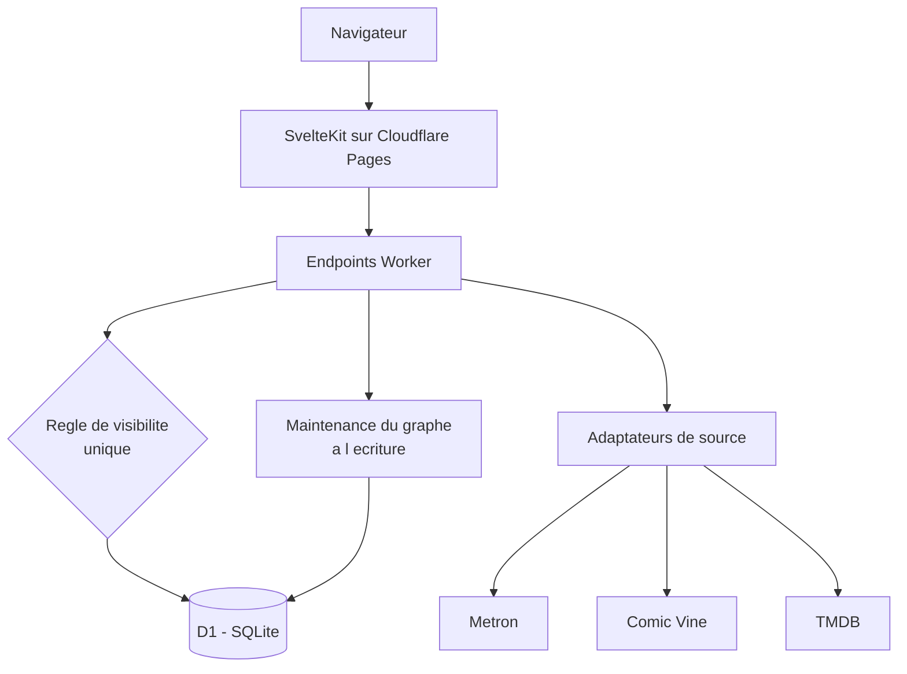
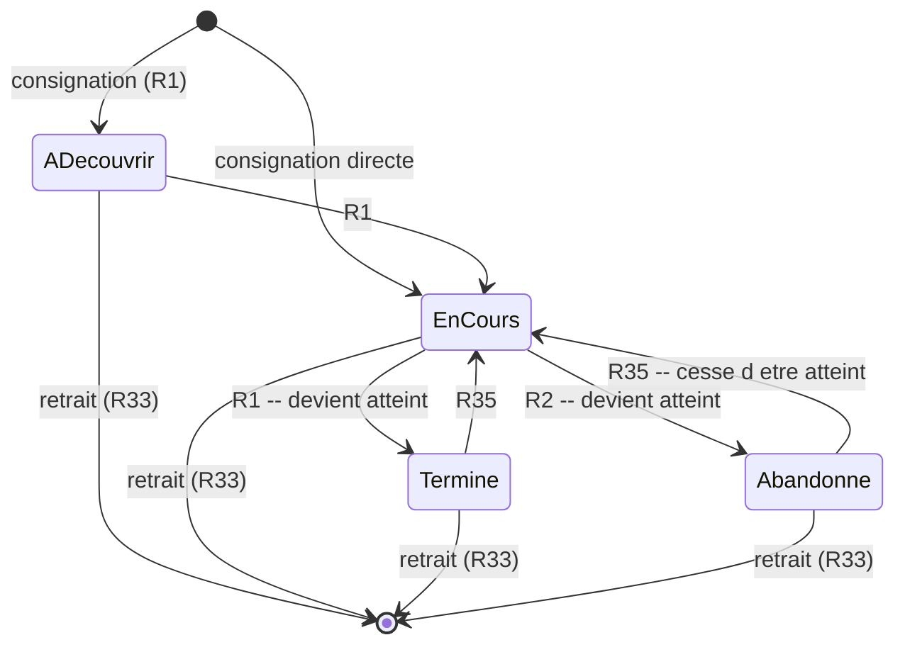
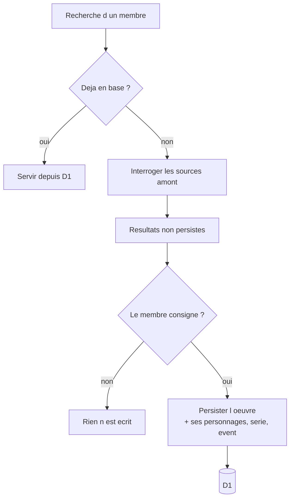

# feat: Compagnon partagé de l'univers Marvel

## Résumé

Construire, en greenfield et sans aucun outil payant, une application web pour un groupe fermé d'une vingtaine d'amis : consigner comics, films, séries et romans, noter, écrire des avis, créer et suivre des ordres de lecture, et faire apparaître un graphe de l'univers à mesure des lectures. Dix unités réparties en quatre phases, dont une première unité de vérification qui conditionne les autres.

---

## Cadrage du problème

Le document d'origine décrit un produit complet mais deux faits découverts en recherche redessinent son socle technique.

**L'API développeur Marvel n'existe plus.** Vérifié le 2026-08-01 : `developer.marvel.com` redirige vers le site grand public et `gateway.marvel.com` renvoie une erreur serveur là où une requête sans clé devrait être poliment refusée. Le catalogue comics — donc le graphe, qui dépend entièrement de la donnée d'apparition des personnages — doit venir d'ailleurs, et les candidats restants sont soit de licence non vérifiée (Metron), soit en déclin documenté (Comic Vine, propriété de Fandom). C'est le risque numéro un du projet et il se traite en premier, pas en chemin.

**Aucun hébergeur gratuit et pérenne n'offre à la fois un disque persistant, un processus toujours chaud et l'absence de plafond artificiel.** Les offres gratuites de Fly.io et Railway ont disparu, celle de Render impose un réveil à froid de 30 à 60 secondes, et les plateformes de type fonction n'ont ni disque ni processus long. Les deux seules architectures réellement tenables sont l'edge Cloudflare, avec un plafond de 10 ms de temps processeur par requête et de 100 000 lignes écrites par jour, ou une machine virtuelle Oracle Always Free entièrement à la charge du développeur.

Ces deux contraintes convergent vers une conséquence utile : **le produit ne peut pas précharger un catalogue de 50 000 numéros, et il n'en a pas besoin.** Vingt personnes consigneront quelques milliers d'œuvres en plusieurs années. Le catalogue s'alimente à la demande depuis les sources amont et conserve ce qui a été consigné.

---

## Exigences couvertes

Le plan couvre l'intégralité des 53 exigences du document d'origine. Traçabilité par unité ci-dessous ; aucune exigence n'est laissée de côté.

| Domaine | Exigences | Unités |
|---|---|---|
| Journal personnel | R1-R6 | U4 |
| Œuvres et médias | R7-R13 | U3, U4, U5 |
| Ordres | R14-R22 | U7 |
| Avancement dans une œuvre longue | R23-R26 | U4, U6 |
| Masquage anti-spoiler | R27-R32 | U6, U8 |
| États et transitions | R33-R39 | U3, U4, U5, U7, U8, U9 |
| Le groupe | R40-R43 | U2, U4, U8 |
| Catalogue et découverte | R44-R47 | U1, U3 |
| Graphe de l'univers | R48-R53 | U9, U10 |

---

## Décisions techniques clés

**KTD1 — Ingestion paresseuse plutôt que préchargement du catalogue.** La recherche interroge les sources amont en direct ; une œuvre n'est persistée localement qu'au moment où un membre la consigne, l'ajoute à un ordre, ou l'atteint depuis une fiche. Trois problèmes disparaissent ensemble : le volume de stockage passe de plusieurs centaines de milliers de lignes à quelques milliers, le plafond d'écriture quotidien des offres gratuites cesse d'être un sujet, et le projet n'a plus besoin d'une phase d'amorçage de plusieurs jours avant de servir à quelqu'un. Le document d'origine dit que le catalogue « s'ingère, il ne se cure pas » (voir origin : `docs/brainstorms/2026-08-01-compagnon-univers-marvel-requirements.md`) — il ne dit pas qu'il se précharge.

**KTD2 — Cloudflare Pages, Workers et D1 comme socle.** Zéro réveil à froid, zéro exploitation à la charge du développeur, et une gratuité réellement pérenne. Les deux plafonds — 10 ms de temps processeur par requête et 100 000 lignes écrites par jour — deviennent inoffensifs sous KTD1. Le plafond processeur impose de ne jamais calculer le graphe visible au moment du rendu, ce qui est de toute façon la bonne conception (voir KTD4). L'alternative sérieuse, une machine Oracle Always Free avec Postgres, est documentée plus bas ; elle achète l'absence de tout plafond au prix de la sécurité, des sauvegardes et des mises à jour à faire soi-même.

**KTD3 — SvelteKit avec l'adaptateur Cloudflare.** Rendu côté serveur, adaptateur mature, faible cérémonie pour un développeur seul, et le rendu serveur est ce qui permet d'appliquer le masquage avant que le contenu n'atteigne le navigateur. Un masquage appliqué côté client enverrait le texte masqué dans la charge utile, ce qui n'est pas du masquage.

**KTD4 — Le graphe visible est matérialisé par membre, jamais calculé au rendu.** Une table d'arêtes visibles par membre est mise à jour quand une œuvre est atteinte ou cesse de l'être. Trois raisons convergentes : le plafond de 10 ms de KTD2 interdit un parcours récursif au rendu ; R33 exige que le retrait fasse reculer le graphe, ce qui suppose de savoir quelles arêtes une œuvre soutenait ; et R52 exige de prouver qu'aucune arête ne provient d'une œuvre non atteinte, vérification bien plus sûre à l'écriture qu'à la lecture. Chaque arête matérialisée conserve la liste des œuvres qui l'établissent, ce qui rend le retrait exact.

**KTD5 — Le masquage est une règle unique appliquée en un seul endroit.** R27 ne consulte que l'état « atteint ». Une seule fonction décide de la visibilité d'un texte, et toute surface qui rend du texte d'avis passe par elle : page d'œuvre, page de profil, fil d'activité, réponse d'API, libellés du graphe. Le défaut que le document d'origine cite chez Goodreads vient d'un masquage réimplémenté par surface ; le prévenir est un choix d'architecture, pas de discipline.

**KTD6 — Sources : Metron en primaire, Comic Vine en complément, TMDB pour l'audiovisuel.** Metron est la plus vivante des bases comics et expose une API ; Comic Vine porte le champ dont dépend le graphe — les personnages crédités par numéro — mais appartient à Fandom et son avenir est incertain ; TMDB, vérifié le 2026-08-01, répond correctement. Les adaptateurs de source sont derrière une interface unique pour qu'en remplacer un ne touche qu'un fichier. **Cette décision est conditionnée à U1** : les licences de Metron et de Comic Vine n'ont pas pu être vérifiées sans créer de compte.

**KTD7 — Graphe rendu avec Cytoscape.js.** Licence MIT, activement maintenu, algorithmes de disposition et filtrage fournis. Il tient confortablement quelques milliers de nœuds, très au-delà du besoin. Sigma.js aurait plus de marge en montée en charge mais demande d'écrire soi-même la logique de filtrage par type de relation, sans bénéfice à cette échelle.

**KTD8 — Progression par ensemble, jamais par rang.** R19 impose que la progression dans un ordre soit l'ensemble des entrées dont l'œuvre est atteinte. Ce n'est pas qu'une règle produit : c'est ce qui rend l'insertion et le réordonnancement d'un ordre inoffensifs pour ses suiveurs (R16), et donc ce qui évite tout versionnage d'ordres. Les entrées portent une identité stable indépendante de leur rang.

---

## Conception technique de haut niveau

### Architecture



Toute lecture de texte d'avis traverse la règle de visibilité. Les adaptateurs de source ne sont appelés qu'à la recherche et à la première consignation d'une œuvre — jamais au rendu d'une page déjà peuplée.

### Cycle de vie d'une œuvre dans le journal

L'état **atteint** est dérivé, pas stocké séparément : il vaut vrai pour « terminé » et « abandonné », faux ailleurs. C'est lui qui pilote le masquage, la progression des ordres et le graphe.



Chaque franchissement de la frontière « atteint » déclenche trois effets à tenir ensemble : recalcul de la progression des ordres suivis contenant l'œuvre (R21), extension ou rétraction des arêtes du graphe (R48, R33), et changement de visibilité des textes attachés (R27).

### Ingestion paresseuse



Seul le chemin « le membre consigne » écrit en base. C'est ce qui garde le volume et les écritures quotidiennes très en dessous des plafonds gratuits.

---

## Structure attendue

```text
src/
  lib/
    server/
      db/
        schema.sql
        migrations/
        queries/
      catalog/
        sources/
          metron.ts
          comicvine.ts
          tmdb.ts
          types.ts
        ingest.ts
        reconcile.ts
      masking/
        visibility.ts
      graph/
        materialize.ts
      orders/
        progression.ts
      auth/
        invitations.ts
    components/
      Graph.svelte
      MaskedText.svelte
      Shelf.svelte
  routes/
    +layout.svelte
    work/[id]/+page.server.ts
    order/[id]/+page.server.ts
    member/[id]/+page.server.ts
    graph/+page.server.ts
    feed/+page.server.ts
tests/
  masking.test.ts
  progression.test.ts
  graph.test.ts
  cascade.test.ts
  sources.test.ts
docs/
  decisions/
    001-sources-de-donnees.md
wrangler.toml
```

La structure est une déclaration d'intention, pas une contrainte. Les listes de fichiers par unité font foi.

---

## Phase 0 — Vérifier avant de bâtir

### U1. Vérification et choix des sources de données

**Objectif.** Établir par constatation directe quelles sources sont utilisables, sous quelle licence, avec quelles limites, et quelle est la qualité réelle de la donnée d'apparition des personnages. Produire une décision écrite qui engage les unités suivantes.

**Exigences.** R44, R45, R46, R12 · conditionne KTD6

**Dépendances.** Aucune. Bloque U3, et par conséquent U9 et U10.

**Fichiers.**
- `docs/decisions/001-sources-de-donnees.md` (créer)
- `src/lib/server/catalog/sources/types.ts` (créer)
- `tests/sources.test.ts` (créer)

**Approche.** Créer les comptes nécessaires, lire les conditions d'utilisation en direct, et mesurer plutôt que supposer. Trois questions décident de tout le reste : la licence autorise-t-elle de stocker les données dans une application privée ; les limites de débit permettent-elles une recherche interactive ; et surtout, sur un échantillon d'une trentaine de numéros couvrant les années 60, 80, 2000 et 2020, quelle proportion porte réellement une liste de personnages exploitable. La réponse à la troisième question détermine si le graphe est un produit ou une déception, et elle ne se devine pas.

Définir dans la foulée l'interface commune des adaptateurs de source, de sorte qu'un changement de fournisseur reste confiné à un fichier. C'est la précaution qui compte le plus ici : Comic Vine porte le meilleur champ et le pire pronostic.

**Note d'exécution.** Cette unité est une vérification, pas une construction. Sa sortie est un document de décision. Ne pas écrire d'adaptateur avant qu'elle ne conclue.

**Scénarios de test.**
- Un test d'intégration par source retenue, appelant l'API réelle avec une clé de développement, vérifiant qu'une recherche par titre renvoie des résultats exploitables.
- Un test qui, pour un numéro connu et récent, vérifie la présence d'une liste de personnages non vide.
- Un test qui, pour un numéro des années 60, documente le résultat obtenu — vide ou non — sans échouer. La lacune historique est une limite acceptée du document d'origine, pas un défaut ; le test sert à la mesurer, pas à la corriger.
- Un test de limite de débit vérifiant le comportement de l'adaptateur face à une réponse de refus : dégradation propre, pas d'exception non traitée.

**Vérification.** Le document de décision nomme la source primaire, la source de complément, leurs licences citées, leurs limites chiffrées, et le taux de couverture mesuré de la donnée de personnages par décennie. Un lecteur peut en déduire si le graphe tiendra ses promesses.

---

### U2. Socle applicatif, déploiement et accès sur invitation

**Objectif.** Une application déployée, joignable, où l'on entre uniquement sur invitation.

**Exigences.** R40

**Dépendances.** Aucune. Peut avancer en parallèle de U1.

**Fichiers.**
- `wrangler.toml` (créer)
- `src/routes/+layout.svelte` (créer)
- `src/lib/server/auth/invitations.ts` (créer)
- `src/lib/server/db/schema.sql` (créer)
- `src/lib/server/db/migrations/001_init.sql` (créer)
- `tests/invitations.test.ts` (créer)

**Approche.** Projet SvelteKit avec l'adaptateur Cloudflare, base D1 attachée, déploiement continu depuis le dépôt. L'authentification reste délibérément minimale : un groupe de vingt amis n'a besoin ni de fédération d'identité ni de rôles. Un membre existant émet un lien d'invitation à usage unique et à durée limitée ; le nouveau venu choisit un nom et un moyen de connexion. Tout membre peut inviter — le document d'origine précise qu'il n'y a pas de rôle d'administration.

Poser dès cette unité les tables des membres, des invitations et des sessions, et le squelette de migration que les unités suivantes étendront.

**Scénarios de test.**
- Un lien d'invitation valide crée un membre et une session.
- Un lien déjà consommé est refusé.
- Un lien expiré est refusé.
- Une page protégée sans session redirige vers l'accueil et ne divulgue aucun contenu du groupe.
- Un membre quelconque peut émettre une invitation ; aucun rôle n'est requis.

**Vérification.** L'application répond à une URL publique sans réveil à froid perceptible, et seul un porteur d'invitation peut entrer.

---

## Phase 1 — Le journal

### U3. Modèle du catalogue et ingestion paresseuse

**Objectif.** Une œuvre existe en base au moment où un membre en a besoin, avec ses personnages, sa série et son event, et jamais avant.

**Exigences.** R7, R8, R12, R44, R45, R46, R47, R39

**Dépendances.** U1, U2

**Fichiers.**
- `src/lib/server/db/migrations/002_catalog.sql` (créer)
- `src/lib/server/catalog/sources/metron.ts` (créer)
- `src/lib/server/catalog/sources/tmdb.ts` (créer)
- `src/lib/server/catalog/sources/comicvine.ts` (créer, si U1 le retient)
- `src/lib/server/catalog/ingest.ts` (créer)
- `src/lib/server/catalog/reconcile.ts` (créer)
- `src/routes/search/+page.server.ts` (créer)
- `tests/catalog.test.ts` (créer)
- `tests/reconcile.test.ts` (créer)

**Approche.** Une table d'œuvres portant un type discriminant — numéro, recueil, film, série, saison, épisode, roman — plus les tables de rattachement : personnages, séries, events, créateurs. Chaque œuvre conserve les identifiants de toutes les sources qui la décrivent, ce qui est la seule façon de dédoublonner plus tard sans perdre l'historique.

La réconciliation est le vrai travail, et le document d'origine le dit. À l'échelle de l'ingestion paresseuse elle reste tractable : on ne réconcilie que ce que quelqu'un consigne. La règle est de rapprocher sur l'identifiant de source quand il existe, puis sur le triplet série, numéro, date de parution, et de ne jamais fusionner automatiquement en cas de doute — une œuvre en double est un désagrément, une fusion erronée est une perte de données.

R47 permet à un membre de corriger une fiche et R39 exige que la correction survive à une ré-ingestion. Les corrections sont donc stockées séparément des données de source et appliquées par-dessus à la lecture, jamais en écrasant la donnée amont.

**Conception technique.** Orientation, non spécification : `œuvre(id, type, titre, date, données_source)` ; `identifiant_source(œuvre_id, source, id_externe)` ; `correction(œuvre_id, champ, valeur, membre_id)` appliquée en surcouche ; tables de liaison `œuvre_personnage`, `œuvre_série`, `œuvre_event`.

**Scénarios de test.**
- Une recherche sur un titre présent en base ne déclenche aucun appel amont.
- Une recherche sur un titre absent interroge les sources et ne persiste rien.
- Consigner une œuvre issue d'une recherche la persiste avec ses personnages, sa série et son event.
- Deux sources décrivant le même numéro produisent une seule œuvre portant deux identifiants de source.
- Deux numéros de même série et même rang mais de dates éloignées ne sont pas fusionnés.
- Une correction de membre survit à une ré-ingestion de la même œuvre depuis la source.
- Une source indisponible dégrade la recherche sans faire échouer la page.
- Couvre R46. Le parcours par personnage renvoie les œuvres liées à ce personnage.

**Vérification.** Un membre trouve une œuvre absente de la base, la consigne, et elle est ensuite servie localement avec ses rattachements.

---

### U4. Journal, étagères et état atteint

**Objectif.** Le geste central du produit : consigner, noter, écrire un avis, retirer.

**Exigences.** R1, R2, R3, R4, R5, R6, R13, R23, R24, R33, R37, R42

**Dépendances.** U3

**Fichiers.**
- `src/lib/server/db/migrations/003_journal.sql` (créer)
- `src/lib/server/journal/entries.ts` (créer)
- `src/routes/work/[id]/+page.server.ts` (créer)
- `src/routes/member/[id]/+page.server.ts` (créer)
- `src/lib/components/Shelf.svelte` (créer)
- `tests/journal.test.ts` (créer)

**Approche.** Une entrée de journal par couple membre-œuvre, portant l'étagère, l'état d'abandon, la position déclarée, la provenance et l'origine de la consignation. L'état **atteint** de R3 est dérivé et non stocké : c'est une fonction de l'étagère et de l'abandon, exposée en un seul endroit pour que rien ne la recalcule différemment ailleurs.

R33 impose que le retrait fasse reculer la progression des ordres et rétracter le graphe. Ces effets appartiennent à U7 et U9 ; cette unité pose le point d'appel unique — franchir la frontière « atteint » dans un sens ou dans l'autre notifie les mécaniques concernées — pour qu'aucune surface n'oublie de le faire.

R13 fixe le niveau d'agrégation : notes et avis s'agrègent à l'œuvre consignée, la page d'une série présentant l'agrégat de ses numéros.

**Note d'exécution.** Écrire d'abord le test de la frontière « atteint » : c'est le prédicat dont dépendent le masquage, les ordres et le graphe, et une erreur ici se propage aux trois.

**Scénarios de test.**
- Consigner une œuvre en « à découvrir » ne la rend pas atteinte.
- La passer en « terminé » la rend atteinte ; en « en cours » ne la rend pas atteinte.
- L'abandon rend atteint sans exiger de note ni d'avis.
- Couvre R35. Reprendre une œuvre abandonnée la fait cesser d'être atteinte.
- Une note peut exister sans avis, et un avis sans note.
- Couvre R33. Retirer une consignation supprime la note et l'avis associés.
- Couvre R24. La position vaut zéro si non commencée, la valeur totale si atteinte, la dernière valeur déclarée si en cours.
- Couvre R37. Un membre modifie et supprime son propre avis ; il ne peut ni modifier ni supprimer celui d'un autre.
- L'agrégat d'une série reflète les notes de ses numéros.

**Vérification.** Un membre consigne, note, commente, retire, et chaque transition produit l'état attendu sans effet de bord ailleurs.

---

### U5. Recueils, cascade et origine des consignations

**Objectif.** Consigner un omnibus consigne ses numéros, sans que le retrait devienne un piège.

**Exigences.** R9, R10, R11, R34

**Dépendances.** U4

**Fichiers.**
- `src/lib/server/db/migrations/004_cascade.sql` (créer)
- `src/lib/server/journal/cascade.ts` (créer)
- `src/lib/server/journal/entries.ts` (modifier)
- `tests/cascade.test.ts` (créer)

**Approche.** Chaque entrée de journal porte son origine — directe, ou dérivée d'un recueil nommément identifié. Un numéro peut être soutenu par plusieurs sources à la fois : une consignation directe et deux recueils qui se chevauchent. Retirer une source ne supprime l'entrée dérivée que si plus aucune ne la soutient, ce que R34 exige et qui est impossible sans ce champ d'origine.

La remontée est distincte de la descente : atteindre tous les numéros d'un recueil l'atteint. R11 restreint la cascade descendante au recueil et à la saison de série télévisée, jamais à une série de comics dont le nombre de numéros n'est pas fini — un point où l'implémentation naïve produirait des consignations aberrantes.

**Conception technique.** Orientation : `entrée_origine(entrée_id, type, source_œuvre_id)` avec plusieurs lignes possibles par entrée ; le retrait supprime une ligne d'origine et ne supprime l'entrée que lorsque la dernière disparaît.

**Scénarios de test.**
- Couvre R9. Consigner un recueil consigne ses numéros, marqués comme dérivés.
- Couvre R9. Atteindre tous les numéros d'un recueil rend le recueil atteint.
- Couvre R34. Un numéro dérivé de deux recueils survit au retrait de l'un des deux.
- Un numéro consigné directement puis couvert par un recueil ne perd pas son origine directe.
- Couvre R11. Consigner une série de comics ne consigne aucun de ses numéros.
- Couvre R11. Consigner une saison de série télévisée consigne ses épisodes.
- Deux recueils qui se chevauchent sur les numéros 5 et 6 produisent une seule entrée par numéro, avec deux origines.
- Retirer la dernière origine d'une entrée dérivée la supprime, ainsi que ses effets sur les ordres et le graphe.

**Vérification.** Toutes les combinaisons de chevauchement se comportent sans perte ni consignation fantôme.

---

### U6. Masquage anti-spoiler

**Objectif.** Un texte est visible si et seulement si le membre a atteint l'œuvre, et aucune surface ne peut y déroger.

**Exigences.** R27, R28, R29, R30, R31, R25, R26

**Dépendances.** U4

**Fichiers.**
- `src/lib/server/masking/visibility.ts` (créer)
- `src/lib/server/db/migrations/005_reveals.sql` (créer)
- `src/lib/components/MaskedText.svelte` (créer)
- `src/routes/work/[id]/+page.server.ts` (modifier)
- `tests/masking.test.ts` (créer)

**Approche.** Une fonction unique décide de la visibilité d'un texte pour un membre donné, et le filtrage se fait côté serveur avant sérialisation — un texte masqué ne doit jamais partir dans la charge utile envoyée au navigateur. R28 impose que notes, agrégats et nombre d'avis traversent toujours ; c'est ce qui rend la page d'une œuvre non atteinte utile plutôt que vide.

R29 ajoute la seule condition intra-œuvre : dans une œuvre longue non atteinte, on ne voit pas ce qui est écrit plus loin que soi. R30 fige la position à la rédaction initiale, de sorte qu'une modification d'avis ne puisse pas re-masquer rétroactivement un contenu déjà lu. R31 rend la révélation explicite et persistante, ce qui demande une table de révélations par membre et par œuvre.

**Note d'exécution.** Écrire les tests avant l'implémentation. C'est la mécanique la plus transverse du produit, celle dont le document d'origine dit que sa fuite chez les concurrents vient de sa réimplémentation par surface.

**Scénarios de test.**
- Couvre AE1. Un membre n'ayant pas atteint l'œuvre ne reçoit pas le texte des avis, y compris dans la charge utile brute de la réponse serveur.
- Couvre AE2. Abandonner une œuvre rend tous ses textes visibles.
- Couvre AE3. Note agrégée et nombre d'avis s'affichent même quand les textes sont masqués.
- Couvre AE12. À 30 % d'un omnibus non atteint, un commentaire écrit à 70 % reste masqué.
- Couvre AE15. Un contenu révélé reste révélé après rechargement, et la révélation n'affecte que ce membre.
- Couvre R30. Modifier un avis après avoir avancé ne change pas sa position enregistrée.
- Couvre R25. Publier sur une œuvre longue non atteinte sans position déclarée est refusé.
- Un membre voit toujours ses propres textes, quelle que soit sa position.
- Scénario d'intégration : la page d'œuvre, la page de profil et le fil appellent tous la même règle et produisent le même verdict pour le même couple membre-œuvre.

**Vérification.** Aucune surface ne rend un texte que la règle refuse, et l'inspection de la réponse serveur le confirme.

---

## Phase 2 — Le social

### U7. Ordres : création, suivi, fork, progression

**Objectif.** La primitive centrale du produit — un chemin dans l'univers, créé par un membre, suivi par les autres.

**Exigences.** R14, R15, R16, R17, R18, R19, R20, R21, R22, R36

**Dépendances.** U4

**Fichiers.**
- `src/lib/server/db/migrations/006_orders.sql` (créer)
- `src/lib/server/orders/progression.ts` (créer)
- `src/lib/server/orders/orders.ts` (créer)
- `src/routes/order/[id]/+page.server.ts` (créer)
- `src/routes/order/new/+page.server.ts` (créer)
- `tests/progression.test.ts` (créer)
- `tests/orders.test.ts` (créer)

**Approche.** Un ordre porte des entrées d'identité stable, dont le rang est un attribut et non l'identité. La progression d'un membre n'est jamais stockée : elle se dérive de l'intersection entre les entrées de l'ordre et les œuvres qu'il a atteintes. C'est ce qui rend R16 vrai sans effort — insérer, retirer et réordonner ne peut pas casser une progression qui ne référence aucun rang.

La progression affichée est le pourcentage d'entrées essentielles atteintes ; l'entrée suivante est la première entrée essentielle non atteinte dans l'ordre de la séquence. Le traitement des entrées facultatives dans le dénominateur est une question que le document d'origine délègue explicitement à la planification : les exclure du dénominateur, faute de quoi un membre qui les saute — usage prévu par R18 — reste bloqué sous 100 % indéfiniment.

Le fork copie les entrées en conservant une référence à l'ordre d'origine. R36 permet de cesser de suivre sans rien perdre : puisque la progression est dérivée, la reprise du suivi la recalcule seule.

**Scénarios de test.**
- Couvre AE4. Atteindre une œuvre présente dans trois ordres suivis fait avancer les trois.
- Couvre AE5. Sur dix entrées essentielles dont les 1, 2, 5 et 9 sont atteintes, la progression est de 40 % et l'entrée suivante est la troisième.
- Couvre AE6. Insérer une entrée en deuxième position ne modifie pas la progression d'un suiveur à mi-parcours.
- Retirer une entrée déjà atteinte par un suiveur ajuste son pourcentage sans erreur.
- Réordonner les entrées ne change aucune progression.
- Les entrées facultatives sont exclues du dénominateur et ne sont jamais proposées comme entrée suivante.
- Couvre R36. Cesser de suivre puis suivre à nouveau restitue la progression exacte.
- Un fork modifié ne modifie pas l'original.
- Seul l'auteur peut modifier son ordre ; un suiveur reçoit un refus.
- Couvre R33. Retirer une consignation fait reculer la progression des ordres concernés.

**Vérification.** Un ordre reste utilisable et juste après insertion, retrait et réordonnancement, pour son auteur comme pour ses suiveurs.

---

### U8. Groupe, fil d'activité et masquage des titres

**Objectif.** Le fil qui fait vivre le produit entre deux lectures, sans devenir la fuite que le masquage évite ailleurs.

**Exigences.** R41, R42, R43, R32, R38

**Dépendances.** U6, U7

**Fichiers.**
- `src/lib/server/db/migrations/007_feed.sql` (créer)
- `src/lib/server/feed/events.ts` (créer)
- `src/routes/feed/+page.server.ts` (créer)
- `src/lib/server/masking/visibility.ts` (modifier)
- `tests/feed.test.ts` (créer)

**Approche.** Un journal d'événements du groupe, alimenté par les transitions du journal personnel, des ordres et des avis. R32 étend le masquage au fil selon une règle plus étroite que R27 : le titre d'une œuvre n'est masqué que pour un membre qui l'a placée sur « à découvrir ». On protège l'intention déclarée, parce qu'on ne peut pas masquer cinquante mille titres sans rendre le fil illisible — le document d'origine assume cette limite.

R42 conserve la provenance d'une consignation et R43 informe le membre dont une recommandation a été suivie, mais seulement lorsque l'œuvre est **atteinte**, pas à la consignation.

R38 traite le départ d'un membre : ses avis et notes restent, anonymisés, et ses ordres restent en place marqués comme sans auteur. Un groupe de vingt amis sur plusieurs années perdra quelqu'un.

**Scénarios de test.**
- Couvre AE13. Un événement portant sur une œuvre placée en « à découvrir » par le lecteur apparaît sans titre lisible.
- Le même événement affiche son titre pour un membre qui n'a pas l'œuvre en « à découvrir ».
- Un événement de type avis n'expose jamais le texte de l'avis dans le fil, quelle que soit la règle sur les titres.
- Couvre R43. Atteindre une œuvre provenant d'un autre membre le notifie ; la simple consignation ne le notifie pas.
- Une cascade de recueil ne produit pas une notification par numéro.
- Couvre R38. Après le départ d'un membre, ses avis restent visibles, anonymisés, et ses ordres restent suivables.
- Retirer une consignation rétracte l'événement correspondant du fil.

**Vérification.** Le fil est vivant et ne gâche rien qu'un membre ait explicitement dit vouloir découvrir.

---

## Phase 3 — Le graphe

### U9. Matérialisation du graphe par membre

**Objectif.** Un graphe exact et instantané, qui grandit et rétrécit avec ce que le membre a atteint.

**Exigences.** R48, R51, R52, R33

**Dépendances.** U3, U4, U5

**Fichiers.**
- `src/lib/server/db/migrations/008_graph.sql` (créer)
- `src/lib/server/graph/materialize.ts` (créer)
- `src/lib/server/journal/entries.ts` (modifier)
- `tests/graph.test.ts` (créer)

**Approche.** Une table d'arêtes visibles par membre, portant les deux nœuds, le type de relation, et la liste des œuvres qui l'établissent. Franchir la frontière « atteint » ajoute ou retire l'appui de cette œuvre sur chaque arête concernée ; une arête disparaît quand elle perd son dernier appui. C'est la même mécanique de comptage d'appuis que les origines de consignation de U5, et elle est ce qui rend R33 exact plutôt qu'approximatif.

R52 est la contrainte la plus subtile : une arête ne doit pas apparaître si le lien qu'elle porte n'est établi que par une œuvre non atteinte, **même lorsque ses deux nœuds sont déjà présents par ailleurs**. Matérialiser à l'écriture rend cette garantie structurelle — une arête sans appui n'existe pas — là où un calcul au rendu inviterait à joindre des nœuds déjà visibles.

**Conception technique.** Orientation : `arête_visible(membre_id, nœud_a, nœud_b, type)` et `arête_appui(arête_id, œuvre_id)`. Atteindre une œuvre insère ses appuis ; cesser de l'atteindre les retire ; l'arête est supprimée quand son dernier appui disparaît.

**Scénarios de test.**
- Couvre AE9. Un personnage n'apparaît pas tant qu'aucune œuvre atteinte ne le fait apparaître.
- Couvre AE10. Deux nœuds présents par ailleurs ne sont pas reliés si leur lien n'est établi que par une œuvre non atteinte.
- Couvre AE14. Retirer une consignation qui soutenait un nœud unique le fait disparaître.
- Une arête soutenue par deux œuvres atteintes survit au retrait de l'une.
- Reprendre une œuvre abandonnée retire ses appuis du graphe.
- Une cascade de recueil ajoute les appuis de tous les numéros atteints, pas ceux du recueil seul.
- Scénario d'intégration : après une centaine d'opérations mêlant consignation, retrait, abandon et reprise, le graphe matérialisé est identique à un recalcul complet depuis zéro.

**Vérification.** Le graphe matérialisé et le recalcul complet coïncident toujours, et aucune arête ne survit sans appui.

---

### U10. Rendu et filtrage du graphe

**Objectif.** Rendre le graphe lisible, filtrable par dimension, et navigable vers les œuvres et les ordres.

**Exigences.** R49, R50, R53

**Dépendances.** U9, U7

**Fichiers.**
- `src/lib/components/Graph.svelte` (créer)
- `src/routes/graph/+page.server.ts` (créer)
- `src/lib/server/graph/query.ts` (créer)
- `tests/graph-render.test.ts` (créer)

**Approche.** Cytoscape.js, alimenté depuis la table d'arêtes matérialisées — le serveur ne fait qu'une lecture indexée, ce qui tient sous le plafond de temps processeur. Les nœuds sont agrégés au personnage, à la série et à l'event (R50), jamais à l'œuvre : c'est ce qui garde le graphe lisible quand un membre a atteint des centaines de numéros.

R49 impose le filtrage par type de relation, qui est le sens opérant de « multidimensionnel » retenu par le document d'origine. Le filtrage se fait côté client sur un graphe déjà chargé tant que le volume le permet ; au-delà de quelques milliers d'arêtes, filtrer côté serveur avant envoi. Prévoir dès maintenant le point de bascule plutôt que de le découvrir en usage.

R53 rend chaque nœud navigable vers les œuvres atteintes qui l'ont établi et vers les ordres du groupe qui les couvrent — c'est ce qui empêche le graphe d'être une contemplation sans suite.

**Scénarios de test.**
- Couvre AE11. Activer un seul type de relation n'affiche que les arêtes de ce type.
- Un graphe vide — nouveau membre — affiche un état d'accueil et non une erreur.
- Couvre R50. Deux œuvres atteintes partageant un personnage produisent un seul nœud pour ce personnage.
- Couvre R53. Ouvrir un nœud donne les œuvres qui l'ont établi et les ordres qui les couvrent.
- Un membre ne peut pas obtenir le graphe d'un autre membre par manipulation d'URL.
- Scénario de charge : un graphe de mille nœuds et cinq mille arêtes reste manipulable, avec mesure du temps de rendu initial.

**Vérification.** Un membre ayant atteint une centaine d'œuvres ouvre son graphe, filtre par dimension, et rejoint une œuvre ou un ordre depuis un nœud.

---

## Impact transverse

Trois mécaniques se croisent sur le même événement — le franchissement de la frontière « atteint » — et doivent rester cohérentes : la progression des ordres, la visibilité des textes, et les appuis du graphe. C'est le point de couplage central du produit. U4 pose le point d'appel unique ; U7, U6 et U9 s'y branchent. Toute nouvelle mécanique consommant l'état de lecture doit s'y brancher aussi plutôt que de recalculer.

Le mécanisme d'appuis apparaît deux fois sous des noms différents : les origines de consignation en U5 et les appuis d'arête en U9. Même forme, même piège — supprimer trop tôt. Traiter le second en s'inspirant du premier.

---

## Risques et dépendances

| Risque | Portée | Traitement |
|---|---|---|
| La donnée d'apparition des personnages est trop lacunaire pour que le graphe ait de l'intérêt | U9, U10 — la moitié de la valeur distinctive du produit | Mesurée en U1 avant toute construction. Si le taux est faible sur le récent, revoir l'ambition du graphe avant la phase 3, pas pendant |
| Comic Vine ferme ou restreint son API | U3, U9 | Adaptateurs derrière une interface unique dès U1 ; Metron en primaire ; la donnée déjà ingérée reste en base |
| Licence de Metron ou de Comic Vine incompatible avec le stockage local | U1, U3 | Bloquant par construction : U1 conditionne U3. Repli sur la Grand Comics Database, au prix d'un travail de parsing |
| Le plafond de 100 000 écritures quotidiennes est atteint | U3 | Rendu improbable par l'ingestion paresseuse. À surveiller lors d'une consignation en masse d'un ordre de plusieurs centaines d'entrées, seul cas plausible |
| Le plafond de 10 ms de temps processeur est dépassé | U9, U10 | Écarté par la matérialisation à l'écriture. Le seul chemin restant à surveiller est le recalcul complet du graphe, à réserver à un traitement différé |
| La réconciliation produit des doublons visibles | U3 | Ne jamais fusionner en cas de doute ; prévoir une fusion manuelle par un membre plutôt qu'une heuristique agressive |
| Personne ne crée d'ordre | U7 — la promesse centrale | Hors de portée technique. Le document d'origine le nomme comme hypothèse porteuse ; le mesurer tôt et l'accepter comme un fait produit |
| Le groupe ne suit pas Marvel | Le projet entier | Assumé en connaissance de cause à l'issue du cadrage produit |

---

## Approches écartées

**Machine virtuelle Oracle Always Free avec Postgres auto-hébergé.** Supprime tout plafond artificiel — écritures, temps processeur, mise en veille — et rend les parcours récursifs possibles au rendu, ce qui aurait dispensé de matérialiser le graphe. Écartée pour deux raisons : la charge d'exploitation, sécurité, sauvegardes et mises à jour comprises, repose entièrement sur un développeur seul ; et l'offre a été réduite de moitié en juin 2026 sans annonce, ce qui en fait un socle dont la stabilité dépend d'une politique unilatérale. La matérialisation du graphe qu'impose Cloudflare est de toute façon la bonne conception au vu de R33 et R52.

**Base de graphe dédiée.** À quelques milliers de nœuds par membre, une table d'adjacence indexée fait le travail. Ajouter un second système de données, avec sa propre limite de niveau gratuit et sa propre synchronisation, serait de la complexité sans contrepartie.

**Préchargement complet du catalogue.** Aurait rendu la recherche instantanée et le parcours par personnage exhaustif dès le premier jour. Écarté par KTD1 : plusieurs jours d'amorçage, une pression permanente sur les quotas gratuits, et un catalogue à quatre-vingt-dix-neuf pour cent inutile à vingt personnes.

**Masquage appliqué côté client.** Plus simple à écrire, et faux : le texte masqué transiterait dans la charge utile et serait lisible par quiconque ouvre les outils de développement. Le rendu côté serveur de KTD3 existe en partie pour cela.

---

## Différé à l'implémentation

- Les noms exacts des tables, colonnes et fonctions.
- La forme précise de la requête de lecture du graphe, qui dépendra du plan d'exécution réel de D1 sur les volumes constatés.
- Le point de bascule entre filtrage client et filtrage serveur du graphe, à établir par mesure et non par estimation.
- Le mécanisme de session retenu, à choisir parmi ce que l'adaptateur Cloudflare rend commode.
- Le volume et l'agrégation exacts des notifications lors d'une cascade, question que le document d'origine délègue explicitement.
- Le comportement d'une reconsignation d'œuvre déjà atteinte — relecture, revisionnage — également délégué par le document d'origine.

---

## Sources et recherche

- Origine : `docs/brainstorms/2026-08-01-compagnon-univers-marvel-requirements.md`
- Vérification directe des sources de données, 2026-08-01 : `developer.marvel.com` redirige vers le site grand public ; `gateway.marvel.com` renvoie une erreur serveur là où une requête sans clé devrait être refusée avec un code dédié ; `metron.cloud` et `comicvine.gamespot.com/api/` répondent ; `api.themoviedb.org/3/` refuse correctement une requête non authentifiée.
- Recherche externe sur les niveaux gratuits, 2026 : disparition des offres gratuites de Fly.io et Railway ; réveil à froid de 30 à 60 secondes chez Render ; plafonds Cloudflare Workers de 10 ms de temps processeur par requête et D1 de 100 000 lignes écrites par jour ; réduction de moitié de l'offre Oracle Always Free en juin 2026 ; désactivation automatique des tâches planifiées GitHub Actions après soixante jours sans activité sur le dépôt.
- Parcours de graphe en base relationnelle : les expansions récursives non bornées se dégradent fortement au-delà de quelques centaines de milliers de nœuds, ce qui conforte la matérialisation à l'écriture retenue en KTD4.
- Bibliothèques de rendu de graphe sous licence MIT et activement maintenues : Cytoscape.js, confortable jusqu'à quelques milliers de nœuds, et Sigma.js avec Graphology, plus de marge au prix d'une logique de filtrage à écrire soi-même.
